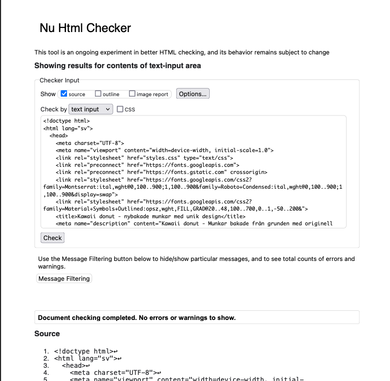
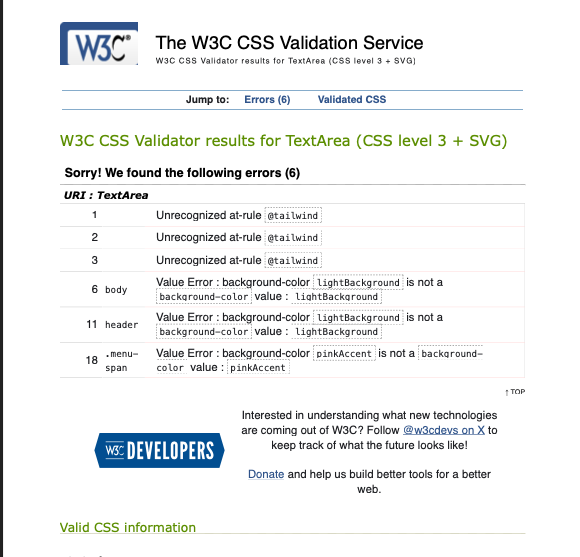
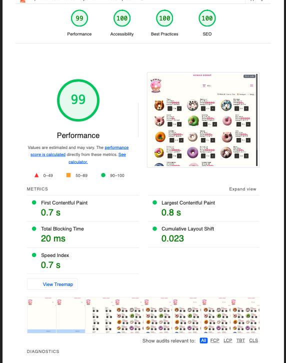

🧁 ##Kawaii Donut Webshop

Kawaii Donut är en responsiv och interaktiv webbshop för fiktiva sötsaker, med fokus på modern design och användarupplevelse. Projektet inkluderar validerad kod, prestandaoptimering och implementering av dark mode.

🌐 Live-version
🔗 https://medieinstitutet.github.io/fed24d-js-intro-inl-1-webshop-CatrinTQ/

📸 Skärmdumpar och analyser
✅ Valideringsrapporter

Alla HTML- och CSS-filer har validerats enligt W3C-standarder. Se valideringsrapporterna nedan:

🚀 

Prestanda, tillgänglighet och SEO har analyserats med hjälp av Google Lighthouse.

    Desktop Lighthouse Score

    Mobile Lighthouse Score

🛠️ Teknikstack

Projektet är byggt med följande teknologier och verktyg:

 
    
 

✨ Funktioner

    Dynamisk Varukorg: Lägg till, ta bort och redigera produkter.
    Dark Mode: Automatisk eller manuell växling mellan ljus och mörk design.
    Responsiv Design: Anpassar sig till alla skärmstorlekar.
    Optimerad Prestanda: Snabb laddningstid och användarvänlighet.

